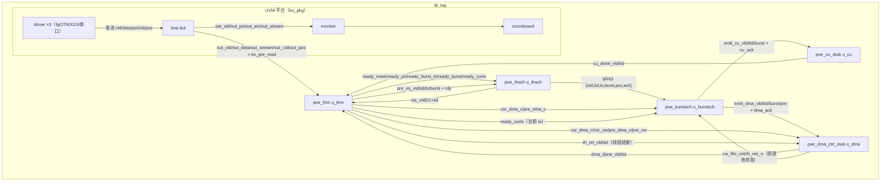

# tb_top 与模块调用结构

> 对应代码：`uvm_poe/tb/tb_top.sv`、`tb/koa_if.sv` 及 `rtl/*`。
> 用途：说明顶层测试平台的内部结构、模块实例化与端口连接、数据流。

## 1. tb_top 内部结构（按代码顺序分区）

```text
tb_top
├─ 时钟/复位：clk 1GHz（#0.5ns 翻转）、rst_n
├─ 接口：koa_if（u_if）——KOA 输入/输出握手信号集
├─ KOA DUT：koa dut（端口全部接 u_if）
├─ POE 链路信号声明（49~96 行）
├─ 模块实例化（98~188 行）
│   ├─ u_thm      : poe_thm        —— 线程管理/保序/CSR
│   ├─ u_thsch    : poe_thsch      —— 一级发射 + 2×burst 队列
│   ├─ u_burstsch : poe_burstsch   —— 二级发射/路由
│   ├─ u_cu       : poe_cu_stub    —— CU/EU 桩
│   └─ u_dma      : poe_dma_ctrl_stub —— dma_ctrl（C 窗资源池）
├─ 占位模型：owin_bp = 0
├─ 激励生成函数（189~231 行）
│   ├─ rand_burst_iv / rand_burst_c / rand_burst_seq（每 ts 4 条 burst 模式）
│   └─ 线程描述旁路 always（ts/bs/pri/burst_seq/vtsk_c/dma_c/cw 随机）
│   └─ ko_pre_read 随机（约 1/16）
├─ 调试日志（233~322 行）：thm_dbg.log（OLD_BURST/EMIT/CBLOCK/ISS/DONE/FINAL）
├─ 复位握手 / 波形 dump / UVM 启动（353~372 行）
└─ final 资源收支校验（376~385 行）
```

## 2. 模块实例化与端口连接



### 关键端口流

| 方向 | 信号 | 说明 |
| --- | --- | --- |
| KOA→THM | `out_vld/out_data/out_stream/out_cid/out_pos` | KO 报文 + 保序键 |
| 激励→THM | `th_ts_cnt/th_bs_cnt/th_pri/th_burst_seq/th_vtsk_c_seq/th_dma_c_seq/th_cw_seq` | 线程描述旁路（模拟 I_BUF_A） |
| THM→th_sch | `ready_mask/ready_pri/ready_burst_ts/ready_burst/ready_curts` | 可发射信息（发射时刻 burst） |
| th_sch→THM | `iss_vld0/1 + iss_tid0/1` | 一级发射请求 |
| THM→th_sch | `pre_inj_vld/tid/ts/burst` ↔ `pre_inj_rdy` | pre_read 插队注入（握手） |
| th_sch→burst_sch | `q0/q1 {vld,tid,ts,burst,pre,ack}` | burst 队列读侧 |
| burst_sch→CU | `emit_cu_vld/tid/burst` ↔ `cu_ack` | i/v_task 发射 |
| burst_sch→dma_ctrl | `emit_dma_vld/tid/burst/pre` ↔ `dma_ack` | c_task 发射（pre 标志透传） |
| CU→THM | `cu_done_vld/tid` | i/v 完成统计 |
| dma_ctrl→THM | `dma_done_vld/tid` | c_task 完成统计 |
| THM→dma_ctrl | `csr_dma_c/csr_cw/pre_dma_c/pre_cw` | CSR 查询（dma_c 决定执行、cw 提供操作信息） |
| THM→dma_ctrl | `th_rel_vld/tid` | 线程结束（兜底归还资源） |
| dma_ctrl→burst_sch | `cw_fifo_cnt/th_res_n` | C 窗资源池状态（发射条件） |

## 3. 数据流分析

**正向（发射路径）**：UVM driver 经 koa_if 驱动 7 路输入 → KOA 写入 5×SBUF（每 SBUF
按 pri 拆 8 段），按组间 SP + 组内 RR 出队 1 条/拍 → THM 保序检查（同 key 活跃则入
8 深缓存）→ 建线程/生成 CSR → th_sch 按
(pri,tid) 选 ≤2 发射进 burst 队列 → burst_sch 判公共条件 + c_task 资源条件 →
i/v 发 CU、c_task 发 dma_ctrl。

**反向（完成/反馈路径）**：CU/dma_ctrl 延迟 LATENCY 后回 done → THM 统计推进 cur_ts
（末 ts 完成 → 线程释放）→ 线程释放时 th_rel 通知 dma_ctrl 兜底归还资源；dma_ctrl 的
资源池状态（cw_fifo_cnt/th_res_n）组合反馈给 burst_sch 做二级发射条件。

**旁路（pre_read）**：ko_pre_read=1 时 THM 不建线程/不查保序，直接经 pre_inj 写入
burst 队列（pre 标志区分），与普通 burst 一起参与二级发射；pre 不占 C 窗资源。

## 4. 激励与观测

- **线程描述旁路**：每个 KO 同拍随机生成 ts_cnt/bs_cnt/pri + 每 ts 的 burst 模式
  （`rand_burst_seq`：4 条中随机 1 条 c_task、其余 i/v） + CSR 初始值（vtsk_c/dma_c/cw）。
- **pre_read**：`ko_pre_read` 约 1/16 概率置位（占位，真实应来自 KO 报文）。
- **日志（thm_dbg.log）**：`OLD_BURST`（队列出现旧 ts 的异常）、`ISS0/1`（一级发射）、
  `EMIT_CU/EMIT_DMA`（二级发射，含 burst 字段）、`CBLOCK`（c_task 资源不足阻塞）、
  `DONE/DONE_DMA`（完成，含 csr.cur_ts 同步校验）、`FINAL`（资源池收支校验）。
- **波形**：$dumpvars 全量 dump（tb_top 及以下），WAVE_FILE 可配。

## 5. UVM 挂接

- `ko_pkg` 全局对象：`g_reset_done`（复位握手）、`g_tb_cfg.vif = u_if`（接口引用，
  Verilator 下 config_db 不可靠走全局）。
- driver 驱动 7 路输入；monitor 采集 KOA 输出；scoreboard 做 8 组优先级参考模型比对。
- **driver ×3（业务源独立）**：fgOTN（OH_EXT/OH_INS）、X2X（APS_EXT/APS_INS/ALM）、
  串口（UART_EXT/INS）各一个 driver + sequencer；同源 item 串行、跨源并发
  （最大 3 路 vld）。KOA 仲裁每拍收 1 条，per-stream rdy 选通保证不丢。
- **接收确认 ack**：KOA 在入队拍寄存输出 ack_vld/ack_*，in_monitor 采 ack（非 vld&&rdy
  握手），与 DUT 实际接收 100% 一致，避免并发时握手采样时序歧义。
- **scoreboard 同刻排序**：同一时刻 OUT 先于 IN 处理，复现 KOA 同拍"先读队首出队、
  后写入队"的语义。
- 测试：`koa_smoke_test`（显式 type_id::get() 防 Verilator 优化掉）。

## 6. 注意事项

- 日志块通过层次引用访问内部信号（`u_thm.th_bs_pc/th_need/csr`、`u_dma.th_res_n_r`
  等），方便波形之外的快速排查，但属于测试平台观测代码，不影响 RTL。
- `u_dma` 的 `dbg_alloc/dbg_free/dbg_done` 为临时诊断计数（final 校验用），
  后续可移除。
- KOA 输入反压由目标优先级队列非满决定（`can_write`），7 路共用同一判决。
