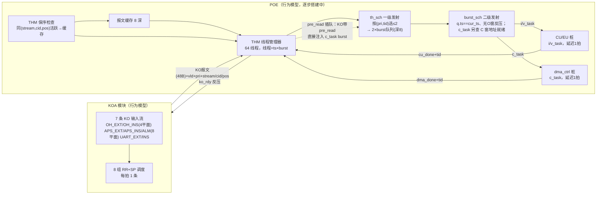
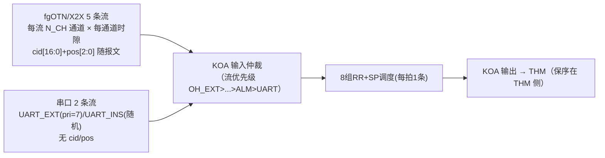
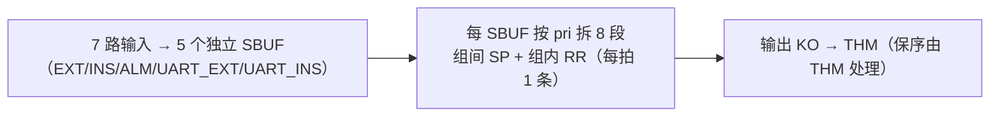
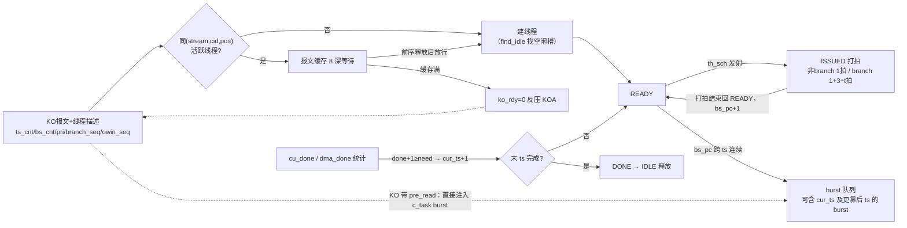
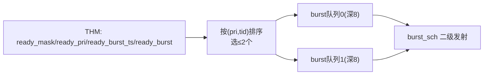
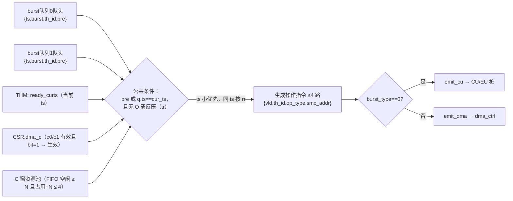

# uvm_poe 平台方案（KOA 调度 + POE THM / th_sch / burst_sch / CU 桩行为模型）

> 用途：从方案层面核对理解是否与预期一致。文档按模块组织：框图、主要变量、处理逻辑。
> 覆盖：KOA 激励与调度行为模型、POE THM / th_sch / burst_sch / CU 桩行为模型（已实现于 `uvm_poe/`）。
> 占位/未覆盖：burst 具体内容、IFU / I_BUF_A、O 窗反压内部设计、EU / dma_ctrl / ts_ctrl、UVM 断言级验证。

## 1. 总体架构



数据流：KOA 收 7 路输入 → 8 组 RR+SP 调度输出 KO 报文 → THM 保序检查
（查自身线程池同 (stream,cid,pos) 活跃线程）→ 允许则建线程，被挡报文存入 8 深缓存等待，
前序线程释放后放行 → th_sch 一级发射（burst 写入 2 个 burst 队列，队列可含 cur_ts 及
更靠后 ts 的 burst）→ burst_sch 二级发射（公共条件 ts 一致 + 无 O 窗反压；c_task 另查
C 窗地址就绪；i/v_task → CU/EU，c_task → dma_ctrl）→ 完成回 THM 统计推进 cur_ts，
末 ts 完成才释放线程。另：KO 报文带 pre_read 标志时，THM 不建线程、不查保序，直接向
burst 队列注入一条 c_task burst，随后按普通 burst 接受二级发射调度。

## 2. 模块 A：KOA 输入激励

### 框图



### 主要变量

| 变量 | 位宽/默认 | 含义 |
| --- | --- | --- |
| `n_oh_planes` / `n_x2x_planes` | 4 / 8 | fgOTN / X2X 平面数 |
| `n_ch_per_plane`（N_CH） | 8 | 每平面最大通道数（实际随机 1..N_CH） |
| 通道时隙表 | 可配 | 每平面各通道时隙数可不同（如 9520=1+1+9518），
  帧周期/带宽优先级按各自时隙数算；上限场景为全通道单时隙 |
| `uart_mpps` | 60 | 串口每路速率（两路各一路） |
| `cid[16:0]` | 17bit | 通道号（1 时隙粒度；仅 fgOTN/X2X 流带） |
| `pos[2:0]` | 3bit | 开销位置序号（OH 0..7 / APS 0 / ALM 0..3；串口不带） |
| `pri[2:0]` | 3bit | 报文优先级（0 最高） |

### 处理逻辑

1. 7 路输入各自按速率模型产生 KO 报文：fgOTN/X2X 按帧（8 KO/帧、1 KO/帧、4 KO/帧）+ 通道相位；
   串口按每拍伯努利概率（≤60 Mpps/路）随机到达。
2. 优先级规则：OH_EXT=7、UART_EXT=7、UART_INS=随机 0..7；OH_INS/APS_EXT/APS_INS/ALM 按带宽
   （通道时隙 1..20→1，>20→0）。
3. fgOTN/X2X 报文带 cid/pos；串口不带（不保序）。
4. 通道时隙数支持每平面自定义分配（各通道可不同），激励按通道时隙表生成帧/速率。

## 3. 模块 B：KOA 5×SBUF + 8 段 RR+SP 调度（保序不在 KOA）

### 框图



### 主要变量

| 变量 | 默认 | 含义 |
| --- | --- | --- |
| `key` | {stream[2:0], cid, pos} | 保序键（THM 侧使用） |
| `rr_ptr` | 0 | 同优先级组内 5 个 SBUF 的 RR 轮询指针（每拍推进） |
| `out_src[2:0]` | — | 输出优先级组号 0..7（观测） |
| `SBUF_DEPTH` | 2560 | 每个 SBUF 总深度（地址拆 8 个 pri 段，每段 320 深 FIFO） |
| `sbuf_cnt[N_SBUF][8]` | 0 | 各 (SBUF, pri) 段占用计数（写 +1 / 读 -1 合并更新） |

### 处理逻辑

1. KOA 有 5 个独立 SBUF：EXT=OH_EXT+APS_EXT、INS=OH_INS+APS_INS、ALM、
   UART_EXT、UART_INS；每个 SBUF 的存储按报文 `pri`（随路传入，0 最高）拆成 8 个
   独立 FIFO 段（每段 320 深，SBUF 总深 2560）。
2. 业务源报文直写对应 SBUF 的 pri 段（无输入仲裁，SBUF 深度吸收突发）；反压只在
   对应段满时拉低（per-plane `rdy`）。**同段合并向量写**：同段同拍可写多条
   （`MAX_WR_SEG` 上限），写入顺序固定 **APS 类（编小优先）→ OH 类（编小优先）**，
   段剩余空间不足时排在后面的候选让位（rdy=0、vld 保持不丢）；tail 按实际写入
   条数推进，cnt 按条数累加。
3. 调度（每拍 1 条）：先按优先级高低选组（SP，组号最小优先）；同优先级组内对 5 个
   SBUF 按 `rr_ptr`（每拍推进）轮询，取最先非空的队列段出队。输出 `out_vld + 48B +
   out_pri + out_src(组号) + out_stream/cid/pos` 给 THM。
4. **保序不在 KOA**：由 THM 侧完成（见模块 C）。

> 已确认：保留 KOA 的 8 组 RR+SP 调度（优先级调度由 KOA 承担，THM/th_sch 只按线程
> 优先级做发射调度）。

## 4. 模块 C：POE THM（线程管理器）

### 框图



### 主要变量

| 变量 | 位宽/默认 | 含义 |
| --- | --- | --- |
| `MAX_THREADS` | 64（参数化） | 并发线程数上限 |
| `th_state` | 4 态 | IDLE / READY / ISSUED / DONE（WAIT 并入 ISSUED 的 th_wait 计数） |
| `th_ts_n / th_bs_n` | [2:0] | 该线程 ts 数 / 每 ts burst 数（1..4） |
| `th_need` | [2:0] | 每 ts 实际 burst 数 = 首个 branch 位置（branch 提前结束）或 bs_n |
| `th_bs_pc` | [4:0] | 全局 burst 流水序号（跨 ts 连续，打拍推进，0..ts_n×need-1） |
| `th_cur_ts` | [1:0] | 当前 ts（仅由 cu_done / dma_done 统计推进） |
| `th_done` | [2:0] | 当前 ts 已完成 burst 数（cu_done / dma_done 累加） |
| `th_wait` | [7:0] | ISSUED 打拍剩余拍数 |
| `th_stream / th_cid / th_pos` | — | 线程来源流 / 通道号 / 开销位置（保序键，THM 自查） |
| `buf_cnt / buf_mem` | 8 深 | 保序等待报文缓存（FIFO） |
| `th_pri_r` | [2:0] | 线程 burst 优先级（调度依据） |
| `th_burst_r` | 4×32bit | 每 ts 的 burst 模式（各 ts 复用，`bs_pc%need` 索引） |
| `ready_mask` | 64bit | READY 且未到头线程位图（给 th_sch） |
| `ready_pri / ready_burst_ts / ready_curts` | — | 发射时刻的优先级 / burst 所属 ts / 当前 ts |
| `ready_burst` | 64×32bit | 发射 burst（bs_pc 索引，32bit） |
| `csr_dma_c / csr_cw` | — | CSR 暴露给 burst_sch（c_task 按 dma_id 查询 dma_c/cw） |
| `pre_dma_c / pre_cw` | — | pre_read 插队 burst 专用 CSR（占位） |
| `ko_rdy` | 1bit | 反压：线程全忙或缓存满时 0 |
| `ko_pre_read` | 1bit | KO 带 pre_read：直接插队注入 c_task burst（不建线程/不查保序） |
| `pre_inj_vld/rdy + tid/ts/burst` | — | 插队注入接口（→ th_sch burst 队列） |
| `dma_done_vld + tid` | — | dma_ctrl 完成（同 cu_done 计入线程 done；pre 保留 tid 忽略） |
| `csr[MAX_THREADS]` | 61B/项 | CSR 表项：建线程时同步生成，存放线程信息（见下） |
| `sys_ts_cnt` | 48bit | 系统时戳计数（1GHz 拍），建线程时写入 csr.sys_ts |

### CSR 表项（线程信息）

新建线程时 THM 同步生成一条 CSR 表项（`csr[tid]`），逐步替换临时字段。当前用
SystemVerilog packed struct 定义（614bit）：

```systemverilog
typedef struct packed {
  logic [7:0]   err;      // 1B：线程错误指示（默认 0，刷新条件待定）
  logic [63:0]  ccr;      // 8B：待定
  logic [47:0]  sys_ts;   // 6B：系统时戳（线程启动时间）
  logic [5:0]   th_id;    // 6bit：线程 id（64 线程）
  logic [7:0]   th_stat;  // 1B：线程状态
  logic [7:0]   o_mes;    // 1B：O 窗操作/状态指示
  logic [7:0]   cur_ts;   // 1B：当前 ts（与 THM cur_ts 含义一致）
  logic [7:0]   vtsk_c;   // 1B：i/v 任务执行掩码（tsk_id 查询）
  logic [7:0]   dma_c;    // 1B：c_task 执行指示（bit i 对应 cw[i]）
  logic [63:0]  tw;       // 8*1B：待定
  logic [8*48-1:0] cw;    // 8×6B：c_task 操作表（条目位域见下）
} csr_t;
```

| 字段 | 位宽 | 含义 | 当前实现 |
| --- | --- | --- | --- |
| `err` | 1B | 线程错误指示，默认 0 | 建线程置 0；刷新条件待定 |
| `ccr` | 8B | 待定 | 占位 0 |
| `sys_ts` | 6B | 系统时戳，线程启动时间 | 建线程时取 `sys_ts_cnt` |
| `th_id` | 6bit | 线程 id（64 线程） | = 线程槽位号 |
| `th_stat` | 1B | 线程状态 | 与 `th_state` 同步（READY/ISSUED/DONE/IDLE） |
| `o_mes` | 1B | O 窗操作/状态指示 | 占位 0，待定义 |
| `cur_ts` | 1B | 当前 ts | 与 `th_cur_ts` 同步（cu_done/dma_done 推进） |
| `vtsk_c` | 1B | i/v 任务执行掩码（tsk_id 查询） | 激励随机占位；CU 实现时按 tsk_id 查询 |
| `dma_c` | 1B | c_task 执行指示（8bit 掩码） | 激励随机占位；dma_ctrl 按 dma_id 查该 bit 决定是否执行 |
| `tw` | 8×1B | 待定 | 占位 0 |
| `cw` | 8×6B | c_task 操作表（dma_id 索引） | 激励随机占位；`dma_c[i]=1` 时查 `cw[i]` |

#### CSR.cw 条目（6B = 48bit）

| 字段 | 位宽 | 含义 |
| --- | --- | --- |
| tag | 20bit | smc 地址（= op_addr） |
| op_type | 1bit | loc/free：0=loc，1=free |
| r | 1bit | c_line 有效（smc 读出刷新 c 窗 c_line 后写 1） |
| o | 1bit | 1=该线程占据该 c 窗资源 |
| c_line_num | 8bit | c 窗资源号（64×4=256） |
| start_ts | 8bit | 起始 ts |
| occ_ts | 8bit | 占据 ts 数 |
| rsv | 1bit | 保留 |

替换计划（逐步）：`th_stat`/`cur_ts` 已与 CSR 同步，后续把 `th_state`/`th_cur_ts`
临时数组整体迁移到 CSR；`dma_c`/`cw` 对应的 c_task burst 侧改造（burst 携带 dma_id，
dma_ctrl 查 CSR 决定执行与操作）为下一步；`err/ccr/vtsk_c/tw/o_mes` 语义待定后填充。

### Burst 结构（32bit，一种结构两种类型）

burst 采用正式结构（`poe_types_pkg`，32b = 4B），`burst_type` 区分两种类型，字段不完全
相同、按类型复用同一比特位（i/v 与 c_task 字段重叠布局，可互 cast）：

```systemverilog
// burst_iv_t（burst_type=0）                    // burst_c_t（burst_type=1）
typedef struct packed {                         typedef struct packed {
  logic        st;                               logic        st;
  logic        tr;                               logic        tr;
  logic [2:0]  ts_len;   // 仅 i/v               logic [3:0]  rev;      // 仅 c_task
  logic        branch;   // 仅 i/v               logic        burst_type;
  logic        burst_type;                       logic        vld_cu;
  logic        vld_cu;                           logic [2:0]  dma_id0;  // 仅 c_task
  logic [2:0]  tsk_id0;  // 仅 i/v               logic        c0;
  logic        c0;                               logic [2:0]  dma_id1;  // 仅 c_task
  logic [2:0]  tsk_id1;  // 仅 i/v               logic        c1;
  logic        c1;                               logic [7:0]  occ_ts0;  // 仅 c_task
  logic [7:0]  sub_pc0;  // 仅 i/v               logic [7:0]  occ_ts1;  // 仅 c_task
  logic [7:0]  sub_pc1;  // 仅 i/v
} burst_iv_t;                                   } burst_c_t;
```

位布局：`st1+tr1+[ts_len3+branch1|rev4]+burst_type1+vld_cu1+[tsk_id6|dma_id6]+c0/c1 2+
[sub_pc16|occ_ts16] = 32bit`。公共字段：st/tr/burst_type/vld_cu/c0/c1。

存储与生成（模型简化）：
- 每 ts 的 burst 模式（`th_burst_seq`，4×32bit）随 KO 旁路进 THM，存 `th_burst_r[tid][0..3]`
  各 ts 复用；当前发射 burst 按 `bs_pc % need` 索引，`ts_len` = 每 ts burst 总数（= bs_cnt），
  `need` = 首个 branch burst 位置（branch 仅 i/v 生效，branch 提前结束本 ts）。
- **任务执行判定**：i/v 任务按 `tsk_id0/1` 查 CSR.vtsk_c（`c0/c1=0` 直接无效）；c_task 任务按
  `dma_id0/1` 查 CSR.dma_c——bit=0 不执行，=1 查 `cw[dma_id]` 的 op_type（loc/free）与
  tag（smc 地址）；`occ_ts0/1` 指示 c_task 占据的 ts 数（dma_ctrl 使用）。

### 处理逻辑

1. **保序检查**：新 KO 报文到达 → 查询 THM 自身线程池：若存在同 `(stream,cid,pos)` 的活跃线程
   （上一帧未处理完，状态非 IDLE）→ 报文存入 8 深缓存等待；缓存满则 `ko_rdy=0` 反压 KOA。
2. **建线程**：无同 key 活跃线程（或缓存队头的前序已释放）且有空闲槽 → 线程进 READY，
   记录 ts_cnt/bs_cnt/pri/branch_seq/owin_seq、stream/cid/pos，`bs_pc=0, cur_ts=0, done=0`
   （burst 内容占位，不访问 I_BUF_A）。槽位由 `find_idle` 自动分配（块内临时变量显式
   `automatic`，避免静态生命周期导致的槽位复用错误）。
3. **一级发射**：线程 READY 且 `bs_pc < ts_n×need` → th_sch 发射该 burst（队列项携带
   `ready_burst_ts = bs_pc/need` 与完整 `ready_burst`（32bit burst）），线程进 ISSUED
   并打拍：非 branch 1 拍；
   branch 1+3+t 拍（t 随机 0..n，n=当拍 READY 线程中当前 burst 带 branch 的个数，模拟
   I_BUF_A 预取访问时间）。打拍结束回 READY，`bs_pc+1`。
4. **T_READY 语义（关键）**：READY ≠ 回到 IDLE。线程回 READY 后可发射下一个 burst，
   且不限制是同一个 ts——`bs_pc` 跨 ts 连续推进，因此一级发射队列里可能同时存在属于
   `cur_ts` 以及更靠后 ts 的 burst；队列不允许出现 cur_ts 以前的 burst（由 burst_sch 以
   `q.ts==cur_ts` 拦在二级发射，见模块 E）。
5. **cur_ts 推进**：cu_done / dma_done 只做统计：`done+1 ≥ need` → `cur_ts+1, done=0`；
   不做状态机写入（避免与同一拍的一级发射 ISSUED 状态冲突）；末 ts 完成 → DONE → 下拍
   IDLE 释放线程（此时该线程所有 burst 均已发射并完成，队列中无残留）。
6. **pre_read 插队**：KO 带 pre_read 且注入侧就绪时，不建线程、不查保序，THM 直接向
   burst 队列注入 c_task burst（th_id 6bit 无保留值，靠队列项 pre 标志区分；
   占位 payload：dma_id 取 KO 报文低 6bit、smc_addr 取首字节，走独立 pre_dma_c/
   pre_mes），随后与普通 burst 一样接受二级发射调度（C 窗条件仍生效，pre 暂不占资源）。
   **预读接口 pre_mes 为 4 组**（与操作指令接口一致，每拍最多 4 个 c_task）；当前模型
   占位单路注入。
7. **反压**：pre_read KO 由注入侧（burst 队列空间）反压；普通 KO 由线程全忙/缓存满反压。

> 已确认：线程描述（ts_cnt/bs_cnt/pri + 每 ts burst 模式）由激励侧随机生成（模拟
> I_BUF_A 内容），后续可改为由 KO 报文携带或配置驱动。

## 5. 模块 D：th_sch（一级发射调度器）

### 框图



### 主要变量

| 变量 | 默认 | 含义 |
| --- | --- | --- |
| `MAX_THREADS` | 64 | 线程数 |
| `QDEPTH` | 8 | 每个 burst 队列深度 |
| `iss_vld0/1 + tid0/1` | — | 一级发射请求（回 THM 打拍） |
| `pre_inj_vld/rdy + tid/ts/burst` | — | THM pre_read 插队注入（直接写 burst 队列） |
| `q0/q1_vld/tid/ts/burst/pre/ack` | — | burst 队列读侧（给 burst_sch） |
| 队列项 | {pre[1], burst[31:0], burst_ts[1:0], th_id[5:0]} = 41bit | burst 所属 ts 取发射时刻的 `ready_burst_ts`（不是 cur_ts）；burst 为 32bit burst；pre=1 为插队 burst（th_id 无线程归属） |

### 处理逻辑

1. 每拍从 `ready_mask` 中按 **(pri, tid) 排序**选 ≤2 个 READY 线程：优先级值小优先，
   同优先级 tid 小者优先；当前优先级不够 2 个时从下一优先级补足。
2. 发射的 burst 写入 2 个 burst 队列（深度 8，队列项含 32bit burst + burst 所属 ts + th_id）；
   队列未满才发射（写侧反压）。
3. **pre_read 插队注入**：THM 带 `pre_inj_vld` 时直接写一条 burst 进 q0（满则 q1），
   队列有空间才握手（`pre_inj_rdy`），与一级发射同拍竞争队列槽位。
4. 读侧由 burst_sch 控制出队（q0/q1 各自 FIFO）。

> 说明：实测随机场景下双发射路径正常触发（ISS0+ISS1 均有发射）。

## 6. 模块 E：burst_sch（二级发射调度器）

### 框图



### 主要变量

| 变量 | 默认 | 含义 |
| --- | --- | --- |
| `q0/q1_vld/tid/ts/burst/pre/ack` | — | 2 个 burst 队列读侧（burst 为 32bit；pre=插队 burst） |
| `thread_curts` | 64×2bit | 各线程当前 ts（THM `ready_curts`） |
| `csr_dma_c` | 64×8bit | 各线程 CSR dma_c（按 tid 索引，判断需执行 c_task 数） |
| `cw_fifo_cnt / th_res_n` | 10bit / 64×2bit | C 窗资源池 FIFO 空闲数 / 各线程已占用资源数（来自 dma_ctrl） |
| `pre_dma_c` | 8bit | pre_read 插队 burst 专用执行掩码（占位） |
| `owin_bp` | 1bit | O 窗反压（外部输入，当前占位固定 0） |
| `emit_cu_vld/tid/burst + cu_ack` | — | 二级发射 i/v_task → CU/EU（每拍最多 1 个） |
| `emit_dma_vld/tid/burst + dma_ack` | — | 二级发射 c_task → dma_ctrl |

### 处理逻辑

1. 每拍分别检查 q0/q1 队头是否可发射。**所有 burst 均须满足两个公共条件**：
   ① `q.pre || q.ts == thread_curts[q.tid]`（普通 burst 属于该线程当前 ts——cur_ts 由
   cu_done/dma_done 推进，队列中不会出现当前 ts 以前的 burst；pre_read 插队 burst 无线程
   归属，跳过本检查）；
   ② 无 O 窗反压：`!(owin_bp && q.burst.tr)`。
2. **c_task 新增条件（不替换公共条件）**：`burst_type=1` 的 burst 按 **c0/c1 判任务是否需发
   dma_ctrl**（0=任务无效不发送），需要时查 CSR.dma_c[dma_id] 确认生效（bit=1），
   需执行任务数 N（0..2）；**C 窗资源池可用**才放行：`cw_fifo_cnt ≥ N` 且该线程已占用
   + N ≤ 4。pre_read 插队 burst 暂不占资源（跳过）。`burst_type=0`（i/v）无此条件
   （i/v 任务按 tsk_id 查 CSR.vtsk_c，由 CU 侧判断是否执行）。
3. **操作指令生成**：生效的 c_task 从 `cw[dma_id]` 取 op_type（loc/free）与 tag（smc 地址），
   与 th_id 组成操作指令 `{vld, th_id, op_type, smc_addr}`（28bit/路，见 §7.2）；
   每拍最多 2 burst × 2 task = 4 路。
4. 两队列均满足（公共条件 + c_task 附加）时优先发 ts 小者，ts 相同按 rr 轮询，
   每拍最多 1 个；目的端 ack（cu_ack / dma_ack）空闲才发射。
5. **发射路由**：burst_type=0（i/v_task）→ CU/EU 桩；=1（c_task）→ dma_ctrl 桩
   （c_task 不发给 CU）。
6. `owin_bp` 为 O 窗资源池占位接口（内部设计后续补充，当前固定 0）；
   C 窗资源池已由 dma_ctrl 的 256 深 FIFO 实际管理（见下）。

### C 窗结构

- **存储**：C 窗 = 64（线程）× 8 × 21B 缓存（资源条目 168bit，每线程 8 个 c_task 槽位）。
- **资源池**：256 深 FIFO 管理 C 窗资源（复位入队资源号 0..255），dma_ctrl 持有。
- **申请**：dma_ctrl 收到 c_task burst 时，按 dma_id 查 dma_c 得需执行任务数 N，从 FIFO
  出队 N 个资源（c 窗地址），登记到该线程；**单线程最多申请 4 个**（发射前由 burst_sch
  检查：`cw_fifo_cnt ≥ N 且占用 + N ≤ 4`）。
- **归还**：c_task 执行完（dma_done）即归还本次申请的 N 个资源；线程结束（THM 通知）
  兜底清理该线程残留资源。
- **pre_read 插队 burst**：暂不占资源（占位，释放时机待定）。

#### C 窗资源条目（168bit = 21B）

| 字段 | 位宽 | 含义 |
| --- | --- | --- |
| tag | 20bit | smc 地址 |
| c_line | 128bit | 行数据（free 时经 RBA 写 SMC） |
| d | 1bit | 数据 dirty：申请后 0，CU 改写 c_line 后 1 |
| o | 1bit | 占用标志：申请到资源后写 1 |
| r | 1bit | c_line 有效：smc 读出刷新 c 窗 c_line 后写 1 |
| cnt | 9bit | 老化计数：超上限强制释放（o=0，资源号入 FIFO） |
| ind | 8bit | c 窗资源号（64×4=256） |

> 待确认：资源若严格"线程结束才释放"，64 线程 × 4 = 256 会占满资源池，任何尚未发完
> c_task 的线程都会因无资源而无法完成 → 必然死锁。当前模型调整为"c_task 完成即归还 +
> 线程结束兜底"，并保留单线程上限 4；若真实设计确有其他机制（如 c_task 完成后即可
> 释放），以此为准。

## 7. 模块 F：CU/EU 桩 与 dma_ctrl 桩

### 7.1 CU/EU 桩（i/v_task 执行）

### 主要变量

| 变量 | 默认 | 含义 |
| --- | --- | --- |
| `LATENCY` | 1 | 执行延迟拍数（发射后 1 拍执行完） |
| `emit_cu_vld/tid/burst + cu_ack` | — | 从 burst_sch 收 i/v_task burst（携带 burst_t） |
| `cu_done_vld + tid` | — | 完成通知（回 THM 统计） |

### 处理逻辑

1. 每拍从 burst_sch 收 1 个 i/v_task burst（`cu_ack` 表示空闲可收）。
2. 延迟 `LATENCY` 拍后回 `cu_done_vld + cu_done_tid`。
3. 线程是否释放/推进 cur_ts 由 THM 依据 done 统计决定（CU 桩不判结束）。
4. 占位：真实 CU 按 burst 的 `tsk_id0/1` 查 CSR.vtsk_c 判断任务是否真实执行
   （`c0/c1=0` 任务无效），按 `sub_pc0/1` 从 I_BUF_B 取子指令；当前桩直接完成。

### 7.2 dma_ctrl 桩（c_task 执行）

| 变量 | 默认 | 含义 |
| --- | --- | --- |
| `LATENCY` | 1 | 执行延迟拍数（发射后 1 拍执行完） |
| `emit_dma_vld/tid/burst/pre + dma_ack` | — | 从 burst_sch 收 c_task burst（pre=插队） |
| `csr_dma_c / csr_cw` | — | CSR：dma_c 决定执行、cw 提供操作类型与 tag |
| `th_rel_vld + tid` | — | THM 线程结束通知（兜底归还残留资源） |
| `cw_fifo_cnt / th_res_n` | — | C 窗资源池状态（给 burst_sch 做发射条件） |
| `dma_done_vld + tid` | — | 完成通知（回 THM 统计，同 cu_done） |

#### 操作指令接口（burst_sch → dma_ctrl，每拍 ≤4 路）

| 字段 | 位宽 | 含义 |
| --- | --- | --- |
| vld | 1bit | 有效位 |
| th_id | 6bit | 线程 id |
| op_type | 1bit | loc / free |
| smc_addr | 20bit | = tag = op_addr |

#### 指令预存资源（16 深缓存）

| 字段 | 位宽 | 含义 |
| --- | --- | --- |
| v | 1bit | 有效位 |
| op_addr | 20bit | smc 地址 |
| op_type | 1bit | loc / free |
| th_id | 6bit | 线程 id |
| cw_ind | 8bit | c 窗资源号 |

### 处理逻辑

1. 每拍从 burst_sch 收 c_task 操作指令（`dma_ack` 表示空闲可收；pre 插队不占资源、
   不回 done）。
2. **资源申请**：接收时按 c0/c1 判任务有效、dma_c 确认生效得需执行数 N，从 256 深
   FIFO 出队 N 个资源登记到该线程（单线程上限 4）。
3. **loc 操作**：按 smc 地址查 C 窗已有 tag（3 拍查找，任一拍相同即相同）。
   - 相同 → 操作指令存入**指令预存资源**（16 深），等资源释放后转交；
   - 不同 → 申请 C 窗资源（FIFO 出队）：资源号写操作信息（`tag+c_line+d+o+r+cnt+ind`），
     更新 CSR.cw（`tag+op_type+r+o+c_line_num+start_ts+occ_ts`），RBA 总线读 tag 地址。
4. **free 操作**：同拍 4 路去重（相同 smc 地址只执行端口号较小者）→ th_id+smc 在 cw
   8 项中查 cw_ind（资源号）→ RBA 把 C 窗资源 c_line 写入 SMC[tag] → 对应 cw 项 o=0
   （释放）→ 查指令预存资源同 smc：有则 cw.c_line_num=资源号、o=1（转交给等待线程）。
5. **执行/归还**：延迟 `LATENCY` 拍后回 `dma_done`，同时归还本次申请的 N 个资源；
   THM 线程结束通知时兜底清理残留。
6. 占位：`occ_ts0/1` 指示 c_task 占据的 ts 数；预留从 KOIU 直接送 KO 报文的**预读接口
   （4 组 pre_mes，与操作指令接口一致）**（pre_read 预读路径）。

## 8. 关键参数汇总

| 参数 | 默认 | 说明 |
| --- | --- | --- |
| `CLK` | 1 GHz | 平台时钟（KOA 输出能力 1 条/拍 = 1 Gpps） |
| `BUF_DEPTH` | 8 | THM 报文缓存深度（保序等待） |
| `CID_W / POS_W` | 17 / 3 | cid / pos 位宽 |
| `MAX_THREADS` | 64 | THM 并发线程数 |
| `MAX_TS / MAX_BURST` | 4 / 4 | 每线程 ts 数 / 每 ts burst 数上限（计数 3bit，1..4） |
| `BURST_W` | 32 | burst 位宽（4B，两种类型） |
| `QDEPTH` | 8 | th_sch 每个 burst 队列深度（2 队列） |
| `TH_ID_W` | 6 | 线程 id 位宽（64 线程） |
| `C_WND_FIFO_DEPTH` | 256 | C 窗资源池 FIFO 深度（资源号 0..255） |
| `C_WND_LAYOUT` | 64×8×21B | C 窗缓存：线程数 × 槽位 × 资源条目（168bit） |
| `C_WND_PER_THREAD` | 4 | 单线程最多申请 C 窗资源数 |
| `CW_ENTRY_W` | 48 | CSR.cw 条目位宽（6B，8 项/线程） |
| `OP_INST_W` | 28 | 操作指令位宽（vld+th_id6+op_type+smc_addr20，4 路/拍） |
| `PRE_MES_W` | 4×28 | pre_read 预读接口（4 组，每组与操作指令一致） |
| `PRE_STORE_DEPTH` | 16 | 指令预存资源深度 |
| `CU_LATENCY` | 1 | CU 桩执行延迟 |
| `DMA_LATENCY` | 1 | dma_ctrl 桩执行延迟 |
| `N_CH` | 8 | 每平面最大通道数（cid 按 1 时隙粒度） |
| `UART_MPPS` | 60 | 串口每路速率 |

## 9. 验证结果（30µs 随机场景）

- 配置：OH 4 平面 × 9520 时隙、X2X 8 平面 × 9520 时隙、N_CH=8 随机拆通道、UART 2×60 Mpps。
- KOA scoreboard：输入 = 输出，错配 0，UVM_ERROR 0。
- THM 链路：线程内 16327 个 burst 全部发射→完成一一对应（EMIT_CU 12633 + EMIT_DMA
  （线程内）3694 = DONE 12633 + DONE_DMA 3694 = 16327）；pre_read 插队 319 条全部经
  EMIT_DMA 发射到 dma_ctrl（pre 不占资源、不回 done）；队列未出现 cur_ts 以前的 burst
  （OLD_BURST = 0）。
- C 窗资源池：256 深 FIFO 管理，c_task 完成即归还 + 线程结束兜底，资源及时复用，
  申请 1785 = 归还 1785（FINAL f_cnt=256），无资源死锁（CBLOCK=0）；
  单线程上限 4 由发射条件保证（激励约束每线程 c_task 需求 ≤4）。
- 每次仿真报告各流反压事件/拍数；波形含 KO 输入/输出、一级/二级发射、cu_done。

## 10. 待确认 / 占位项

| 项 | 状态 |
| --- | --- |
| burst 具体内容 | 已定义：32bit 一种结构两种类型（burst_type 区分，字段重叠） |
| 线程描述来源（I_BUF_A 内容模拟） | 激励侧随机生成，待定 |
| IFU / I_BUF_A 真实访问 | 不实现（branch 用 1+3+t 拍模拟预取） |
| O 窗反压 owin_bp 内部设计 | 占位，外部固定 0 |
| C 窗资源归还时机（当前：dma_done 归还 + 线程结束兜底） | 待确认（严格线程结束才释放会死锁） |
| pre_read 插队 burst 的 C 窗资源管理 | 占位，暂不占资源，待定 |
| cw 表项内部位域 | 已定义：tag20+op_type1+r1+o1+c_line_num8+start_ts8+occ_ts8+rsv1 = 48bit |
| C 窗资源条目位域 | 已定义：tag20+c_line128+d1+o1+r1+cnt9+ind8 = 168bit |
| CSR.vtsk_c 与 CU 任务执行判定 | 桩未判，待 CU 实现时按 tsk_id 查询 |
| occ_ts0/1 的语义使用（dma_ctrl） | 桩未使用，待 dma_ctrl 实现 |
| dma_ctrl 完成反馈 | 桩实现回 dma_done 计入线程 done，待确认真实 dma_ctrl 是否回报完成 |
| pre_read 标志来源与插队 payload（dma_id/smc_addr） | tb 随机标志 + KO 报文低 6bit/首字节占位，待定 |
| EU / dma_ctrl / ts_ctrl | 未实现（后续模块） |
| THM 链路的 UVM 断言验证 | 未加（当前靠事件日志/守恒检查） |
| 保序检查的"活跃线程"判定 | 已确认：线程状态非 IDLE 即活跃 |
| KOA 8 组 RR+SP 是否保留 | 已确认：保留 |
| 通道时隙表表达方式 | 已确认：每平面数组随机拆分（可 1+1+9518），全单时隙为上限场景 |
