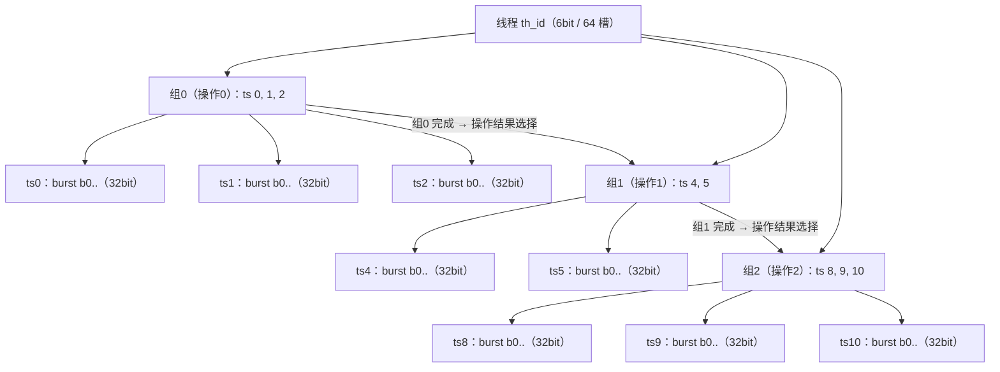

# POE_THM 线程数据结构（简化版）

> 目的：明确"一个线程"的简化数据结构。
> 新模型：线程 = 若干**组 ts**，每组 ts 下的 burst 共同实现**一个操作**，
> 该组执行完后根据**操作结果**选择跳转到另一组 ts。
>
> 用户示例：一个线程有 3 组 ts —— 组0 {0,1,2}、组1 {4,5}、组2 {8,9,10}。

## 1. 模型与层级



语义要点：

- **组 = 跳转单元**：组内所有 ts 按序执行，组内 burst 共同完成一个操作；
  该组全部 burst 完成后，根据操作结果选择跳转目标组（运行时决定，描述符不存静态目标）。
- **ts = 执行单元**：每个 ts 有独立编号（id）和 burst 数（1..4）。
- **burst = 32bit 双类型结构**：保留 i/v_task / c_task 区分（`burst_type`），
  字段与位宽按《数据结构位宽总表.md》burst 部分，不在本文件展开。
- **组间 id 必须跳变**：组内 ts id 连续，组间边界处 ts id 不连续
  （如 `{0}` 后不能跟 `{1,2}`，否则应合并为同一组）；组间跳转间隔 1~3 个 id
  （相邻两组首尾 id 差 2~4），组边界即 ts id 的跳变点。
- **线程锁（线程级）**：每个线程可申请 1 个锁资源（共 8 个），参数为申请标志 + 资源号；
  线程**开始时申请**（建线程后、发射前），**结束时释放**（T_DONE → 槽位回收），
  同号互斥，未申请到锁的线程等待。
- **branch / ts_len 由生成结果回填**：先生成线程结构（组、ts、每 ts burst 数），
  再按生成结果填充 burst 表项：
  - `ts_len` = 所属 ts 的 burst 数（`ts_bs_cnt[ts]`）；
  - `branch` = 组内**最后一个 ts 的收尾 burst** 置 1，作为组间跳转标记，
    例：组0 的 ts2 的收尾 burst 带 `branch=1`；末组不置（0）。

| 层级 | 上限 | 标识/字段 | 说明 |
| --- | --- | --- | --- |
| 线程 | 64 | `th_id`（6bit） | 线程槽、保序键归属 |
| ts 组 | 8（`MAX_GRP`） | 组下标（0..7） | 每组实现一个操作，跳转目标 |
| ts | 16/线程（`MAX_TS`） | `ts_id`（6bit，可跳转） | 组内编号连续存放 |
| burst | 4/ts（`MAX_BURST`） | burst 序号（0..3） | 32bit 双类型结构（i/v / c，按总表） |

## 2. 线程描述（输入参数）

按用户需求，一个线程只需要以下参数：

| 参数 | 位宽 | 说明 |
| --- | --- | --- |
| `ts_n`（总 ts 数） | 5bit | 1..16，= Σ 每组 ts 数 |
| `grp_n`（ts 组数） | 4bit | 1..8 |
| `grp_ts_n[grp]`（每组 ts 数） | 8×5 = 40bit | 每组 1..16，和为 `ts_n` |
| `ts_id[ts]`（每个 ts 的 id） | 16×6 = 96bit | 组内连续存放；组边界由前缀和推出 |
| `ts_bs_cnt[ts]`（每个 ts 的 burst 数） | 16×3 = 48bit | 每 ts 1..4 |
| `burst[ts][burst]`（burst 内容） | 16×4×32 = 2048bit | 每 ts 至多 4 个 burst；每个 32bit，保留 i/v_task / c_task 双类型结构（字段见《数据结构位宽总表.md》burst 部分） |
| `lock_vld`（是否申请线程锁） | 1bit | 1=申请，0=不申请 |
| `lock_id`（锁资源号） | 3bit | 0..7，共 8 个线程锁资源 |

描述本体合计：`5+4+40+96+48+2048+1+3 = 2245bit`（不含线程归属的保序键；
`pri` 优先级暂不使用，已移除，后续需要可恢复 3bit）。

## 3. 组边界与 ts 定位（推导，不存储）

- 组前缀和：`grp_off[0]=0`，`grp_off[g+1] = grp_off[g] + grp_ts_n[g]`；
- 组 g 的 ts：`ts_id[grp_off[g] +: grp_ts_n[g]]`；
- ts 的 burst：`burst[ts][0 +: ts_bs_cnt[ts]]`；
- 线程总 burst 数：`Σ ts_bs_cnt[ts]`（供 `bs_pc` 判到头）。
- 组间边界规则：相邻两组边界处 ts id 必须跳变（组内连续、组间不连续）；
  若出现连续（如 `{0}` 后跟 `{1,2}`），应合并为同一组；组间跳转间隔 1~3 个 id
  （相邻组首尾 id 差 2~4）。

## 4. 结构体定义（SystemVerilog 建议）

```systemverilog
// burst 字段按《数据结构位宽总表.md》§2 与 poe_types_pkg 的
// burst_iv_t / burst_c_t（32bit，一种结构两种类型，可互 cast）。

// ---- 线程描述：输入侧（模拟 I_BUF_A / 保序缓存条目）----
typedef struct packed {
    logic [4:0] ts_n;              // 总 ts 数（1..16）
    logic [3:0] grp_n;             // ts 组数（1..8）
    logic [7:0][4:0] grp_ts_n;     // [grp] 每组 ts 数（1..16）
    logic [15:0][5:0] ts_id;       // [ts] 每个 ts 的 id（组内连续）
    logic [15:0][2:0] ts_bs_cnt;   // [ts] 每个 ts 的 burst 数（1..4）
    logic [15:0][3:0][31:0] burst;  // [ts][burst]：32bit，i/v_task / c_task 双类型
    logic lock_vld;                // 是否申请线程锁（1=申请）
    logic [2:0] lock_id;           // 锁资源号（0..7，共 8 个）
} thread_desc_t;                   // 2245bit

// ---- 线程表项：THM 内部存储（每线程 1 份）----
typedef struct packed {
    logic [1:0] state;             // IDLE/READY/ISSUED/DONE
    logic [3:0] grp_idx;           // 当前组（操作结果跳转后更新）
    logic [3:0] ts_idx;            // 当前 ts（全局序号，组内连续）
    logic [5:0] cur_ts;            // 当前 ts 编号 = ts_id[ts_idx]
    logic [6:0] bs_pc;             // 全局 burst 流水序号（跨 ts 连续）
    logic [7:0] wait;              // ISSUED 打拍计数
    logic [2:0] done;              // 当前 ts 已完成 burst 数
    thread_desc_t desc;            // 线程描述（2245bit）
    logic [2:0] stream;            // 保序键：来源流
    logic [16:0] cid;              // 保序键：通道号
    logic [2:0] pos;               // 保序键：开销位置
    csr_t csr;                     // CSR 表项（614bit，独立保留）
} th_entry_t;                      // 2916bit/线程
```

表项存储合计：`2+4+4+6+7+8+3+2245+3+17+3+614 = 2916bit`，64 线程约 23328B。

## 5. 示例（用户给的 3 组线程）

总 ts 数 = 8，组数 = 3：

| 组 | 每组 ts 数 | 组偏移 | ts id（组内） | 每 ts burst 数（举例） |
| --- | --- | --- | --- | --- |
| 组0 | 3 | 0 | {0, 1, 2} | ts0=1，ts1=2，ts2=2 |
| 组1 | 2 | 3 | {4, 5} | ts4=3，ts5=1 |
| 组2 | 3 | 5 | {8, 9, 10} | ts8=2，ts9=2，ts10=1 |

线性表：`grp_ts_n = {3,2,3}`，`grp_off = {0,3,5,8}`，
`ts_id[0..7] = {0,1,2,4,5,8,9,10}`，`ts_bs_cnt = {1,2,2,3,1,2,2,1}`；
线程锁（举例）：`lock_vld=1`，`lock_id=2`（申请 8 个锁资源中的 2 号）。

每个 burst 仍为 32bit 双类型结构（`burst_type` 区分 i/v_task / c_task），
表中的 b0.. 仅为占位标识。

burst 表项由生成结果回填（先有结构、后有 burst 字段）：

| ts | burst 数 | 各 burst 的 ts_len | branch |
| --- | --- | --- | --- |
| ts0（组0） | 1 | 1 | 0（组内非末 ts） |
| ts1（组0） | 2 | 2 | 0（组内非末 ts） |
| ts2（组0） | 2 | 2 | 收尾 burst = 1（组0 末 ts，跳转标记） |
| ts4（组1） | 3 | 3 | 0（组内非末 ts） |
| ts5（组1） | 1 | 1 | 收尾 burst = 1（组1 末 ts，跳转标记） |
| ts8..10（组2，末组） | 2/2/1 | 对应值 | 0（末组不跳转） |

执行流程：

1. 建线程成功、申请锁成功（`lock_vld=1`、`lock_id=2`）后开始发射；
   `grp_idx=0`，`ts_idx=grp_off[0]=0`：顺序执行 ts0 → ts1 → ts2；
2. 组0 全部 burst 完成 → 取操作结果选择下一组（如结果指向组1）→ `grp_idx=1`，
   `ts_idx=grp_off[1]=3`；
3. 顺序执行 ts4 → ts5，组1 完成 → 按结果跳组2，`grp_idx=2`，`ts_idx=grp_off[2]=5`；
4. 执行 ts8 → ts9 → ts10，末组完成 → 线程 T_DONE → 释放锁（2 号）→ 槽位回收。

### 5.2 生成示例：4 组 / ts0 单 i_task / 锁申请 1 号

结构概览：

| 项 | 值 |
| --- | --- |
| 组数 | 4（`grp_n=4`） |
| 总 ts 数 | 9（`ts_n=9`） |
| 每组 ts 数 | `grp_ts_n={1,3,2,3}`，`grp_off={0,1,4,6,9}` |
| ts id | `ts_id[0..8]={0,2,3,4,6,7,9,10,11}`（组间跳变：0→2，4→6，7→9） |
| 每 ts burst 数 | `ts_bs_cnt={1,2,3,2,3,1,2,2,1}`（总 burst 17，bs_pc 0..16） |
| 线程锁 | `lock_vld=1`，`lock_id=1`（申请 1 号锁） |
| 约束 | ts0 仅 1 个 i_task burst；每组首、末 burst 均为 iv_task |

burst 明细（记法：`iv1{t}` 单任务 / `iv2{t0,t1,s0,s1}` 双任务；
`c1{d,o}` 单 / `c2{d0,d1,o0,o1}` 双；方括号依次为 st, ts_len, branch, tr）：

| 组 | ts（id） | bs 数 | burst 明细 |
| --- | --- | --- | --- |
| 组0 | ts0（0） | 1 | b0 `iv1{t1}` [1,1,1,0]（组0 唯一 burst，单 i_task，组末跳转） |
| 组1 | ts2（2） | 2 | b0 `iv2{t0,t3,s=0x10,0x20}` [1,2,0,0]；b1 `c1{d2,o1}` [0,2,0,0] |
| 组1 | ts3（3） | 3 | b0 `c2{d1,d4,o1,2}` [1,3,0,0]；b1 `iv1{t5,s=0x30}` [0,3,0,1]；b2 `c1{d6,o3}` [0,3,0,0] |
| 组1 | ts4（4） | 2 | b0 `c1{d3,o2}` [1,2,0,0]；b1 `iv1{t2,s=0x40}` [0,2,1,0]（组末+跳转） |
| 组2 | ts6（6） | 3 | b0 `iv1{t4,s=0x50}` [1,3,0,0]；b1 `c2{d5,d0,o1,1}` [0,3,0,1]；b2 `iv2{t6,t7,s=0x60,0x70}` [0,3,0,0] |
| 组2 | ts7（7） | 1 | b0 `iv1{t1,s=0x80}` [1,1,1,0]（组末+跳转） |
| 组3 | ts9（9） | 2 | b0 `iv1{t0,s=0x90}` [1,2,0,0]；b1 `c1{d7,o1}` [0,2,0,0] |
| 组3 | ts10（10） | 2 | b0 `c2{d0,d2,o2,1}` [1,2,0,0]；b1 `iv1{t3,s=0xA0}` [0,2,0,0] |
| 组3 | ts11（11） | 1 | b0 `iv2{t5,t6,s=0xB0,0xC0}` [1,1,0,0]（末组尾 burst，branch=0） |

约束核对：

- 组间 ts id 跳变：0→2、4→6、7→9，无跨组连续 ✓；
- 每组首 burst 为 iv_task：ts0.b0、ts2.b0、ts6.b0、ts9.b0 ✓；
- 每组末 burst 为 iv_task：ts0.b0、ts4.b1、ts7.b0、ts11.b0 ✓；
- branch：组0..2 的组末收尾 burst = 1（ts0.b0、ts4.b1、ts7.b0），末组 = 0 ✓；
- ts_len = 所属 ts 的 burst 数 ✓；锁 1 号，线程开始申请、结束释放 ✓。

执行顺序：组0（ts0）→ 按结果跳组1（ts2→ts3→ts4）→ 跳组2（ts6→ts7）→
跳组3（ts9→ts10→ts11）→ 末组完成 → T_DONE → 释放 1 号锁。

## 6. 与旧方案差异（简化点）

| 旧方案 | 新方案 |
| --- | --- |
| burst 为 32bit 双类型结构（i/v 与 c 字段重叠复用） | **保留**：burst 仍按《数据结构位宽总表.md》原样（32bit，i/v / c 区分） |
| 跳转在 burst 级（`branch` 随机 + 等待 1+3+t） | 跳转在**组级**：`branch` 由生成结构回填为组末标记，组完成 → 按操作结果跳组 |
| 线程描述含 vtsk_c / dma_c / cw 初值 | 从描述符移除，CSR 与线程结构解耦 |
| ts0 固定 1 个 burst | 每个 ts 独立 1..4 个 burst |
| `th_off` 只做 ts 级前缀和 | 增加组级前缀和 `grp_off`，ts 定位不变 |

## 7. 待确认 / 可扩展

- `MAX_GRP=8` 为文档默认值，可调；burst 固定 32bit 双类型结构（按总表）；
- `branch` / `ts_len` 语义已明确：由先生成的线程结构推导回填
  （`ts_len`=所属 ts burst 数；`branch`=组末 ts 收尾 burst 的跳转标记），不是独立随机量；
- 末组是否也置 `branch=1` 以统一表示"线程结束"，可后续确认（当前建议置 0）；
- 线程锁已明确为线程级：开始时申请、结束时释放、同号互斥；
  未取得锁时的等待/反压机制为实现细节，落地代码时确定；
- 跳转目标由操作结果运行时决定；如需静态跳转表，可增加 `grp_next[grp]` 字段；
- 落地到代码：`poe_types.sv`（结构体）、`poe_thm.sv`（表项与组跳转状态机）、
  `tb_top.sv`（线程描述生成）需同步改造。
